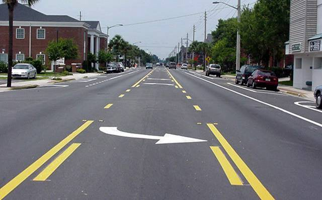
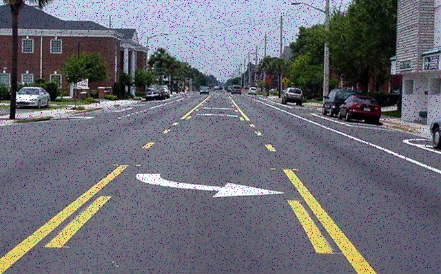
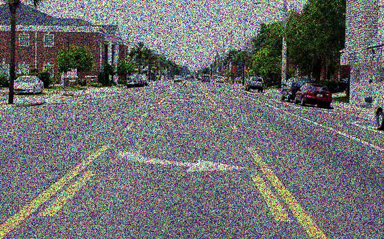
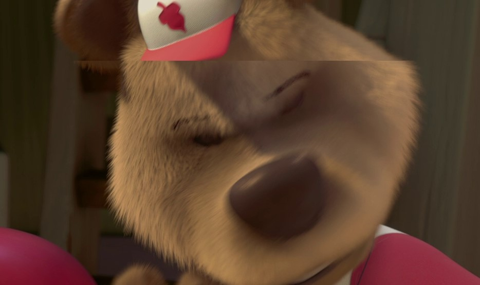

# icct
Image corruption classification tool

# image_aug.py

The script can be used to generate augmented images.
Pass a source path of the image.
Mentioned the type of corruption without extra spaces.
A folder will be created in an output directory name same as the class of corruption.

## Implemented Noise and corruption Models:

### Original Image

### 1. Salt and Pepper Noise

### 2. Speckle Noise 

### 3. Screen Tearing

## Need to do

### 1. Add more augmentation techniques on color,hue saturation.
